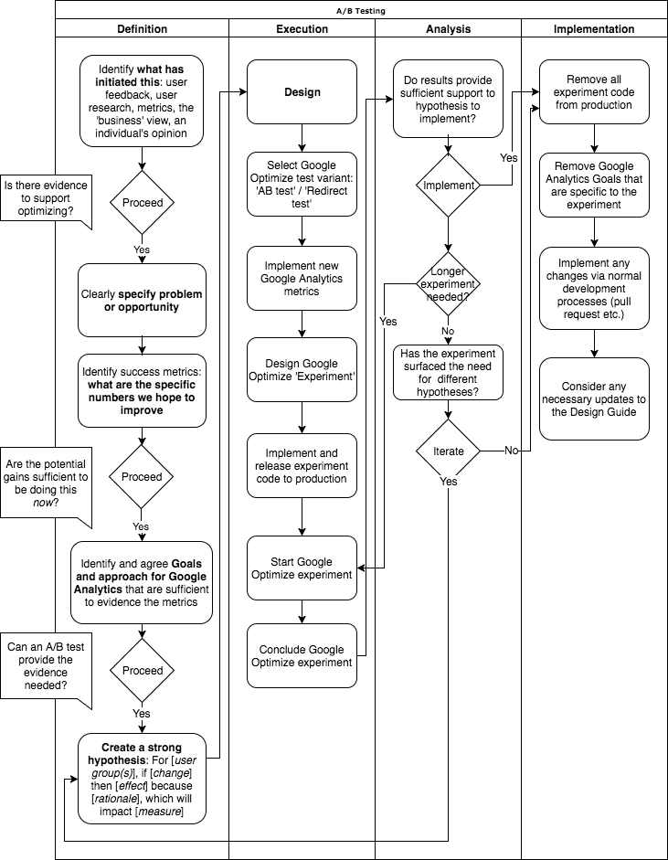

# A/B Testing Experiments

We are exploring potential optimizations to our digital services using A/B Testing. This repository:
 
* outlines our current process for variant testing
* describes some options for its usage

This process is structured around the types of A/B testing described in the [Website Testing 101 White Paper](https://cdn.webtrends.com/files/resources/Whitepaper-WebsiteTesting101-Webtrends-2015.pdf). These are:

* **A/B testing** - one design, group of elements or copy is compared to another, where a portion of live traffic is routed to each. Types of A/B test include:
    * **Template test** - different layouts and/or creative treatment 
    * **New concept test** - comparing two very distinct pages
    * **Funnel test** - comparing different multi-page experiences


A flowchart showing the overall process we are currently working with is [available for download in PDF format](testing-process.pdf) and shown below: 



This can and should be updated to reflect what we learn from running further experiments.

## Google Optimize

We are currently using Google Optimize because it allows us to:

* Perform experiments with quite fine grained control over cohorts, duration and device characteristics
* Conduct A/B testing ranging from small changes (involving minor stylistic or editorial changes) to larger structural, behaviour and multi-page experiences using the redirect variant.
* Link these experiments to our goals in Google Analytics


### Selecting the appropriate Google Optimize test variant

Example use cases for the Google Optmize 'Optimize A/B' and 'Redirect' variants are shown below:

|                                               | Optimize A/B       | Redirect           | Example                                                                         |
| --------------------------------------------- |:-------------:     | :--------:         |:------------------:                                                             |
| Static URLs                                   | :white_check_mark: | :white_check_mark: | `http://www.nationalarchives.gov.uk/about/visit-us/`                            |
| Static URLs with state passed in query string | :white_check_mark: | :white_check_mark: | `http://discovery.nationalarchives.gov.uk/results/r?_q=nelson&_col=200&_hb=tna` |
| Static URLs with state passed in hash         | :white_check_mark: | :white_check_mark: | `http://www.nationalarchives.gov.uk/webarchive/atoz/#t`                         |
| Dynamic URLs with state passed in path        | :white_check_mark: |                    | `http://a-b-testing-experiments.azurewebsites.net/details/C4462857 http://a-b-testing-experiments.azurewebsites.net/details/D8206854` |

-------


## Practical examples using Google Optimize

### The A/B Test

In practical terms, what Google Optimize describe as a A/B test will be best suited to an **A/B Template Test focused on creative treatment** that can be achieved through: 

* CSS alone
* Minor text changes (within, for example, buttons but not ideally suited to changes within large blocks of text)

During the technical spike we created an experiment that showed 50% of visitors teal buttons and 50% of visitors black buttons with a teal border:


#### Information for developers

This was achieved via the Google Optimize dashboard by creating a variant and assigning the related CSS styles. Each 'experiment' requires an amendment to the Google Analytics code snippet on the corresponding page. For example, the A/B test above needed an additional `require()`, a new `<style>` block and a new `(function(a,s,y,n,c,h,i.d.e) { ... })` call: 

```html
<style>.async-hide { opacity: 0 !important} </style>
<script>(function(a,s,y,n,c,h,i,d,e){s.className+=' '+y;h.start=1*new Date;
        h.end=i=function(){s.className=s.className.replace(RegExp(' ?'+y),'')};
        (a[n]=a[n]||[]).hide=h;setTimeout(function(){i();h.end=null},c);h.timeout=c;
    })(window,document.documentElement,'async-hide','dataLayer',4000,
        {'GTM-WK69MVV':true});</script>

<script>
    (function(i,s,o,g,r,a,m){i['GoogleAnalyticsObject']=r;i[r]=i[r]||function(){
        (i[r].q=i[r].q||[]).push(arguments)},i[r].l=1*new Date();a=s.createElement(o),
        m=s.getElementsByTagName(o)[0];a.async=1;a.src=g;m.parentNode.insertBefore(a,m)
    })(window,document,'script','https://www.google-analytics.com/analytics.js','ga');
    ga('create', 'UA-108354863-1', 'auto');
    ga('require', 'GTM-WK69MVV');
    ga('send', 'pageview');
</script>
```

Having looked at the behaviour of this code it seems Google achieve this by:

* applying the `.async-hide` class to prevent a flash of unstyled content as the page loads
* injecting inline `<style>` blocks with the rules added via the dashboard
* removing the `.async-hide` class to reveal the content, which now has the desired styles applied

Note: while this does not seem to significantly impact upon progressive enhancement since those users who are unable to run JavaScript will see the original variant, those users who do have JavaScript will have any content with `.async-hide` hidden from them until the relevant scripts have run. 

### Google Optimize Redirect Test

In practical terms within a CMS environment, the **Redirect Test will allow us to significantly amend the structure, content CSS and JavaScript**. It therefore seems most suited to:
 
* the 'Template Test - Different Layout' and 'New Concept' variants of A/B Tests
* where the full URL is known

During the technical spike we created a Google Optimize experiment that redirected 80% of users to a different page (within a `/new/` directory) that has a different layout.

